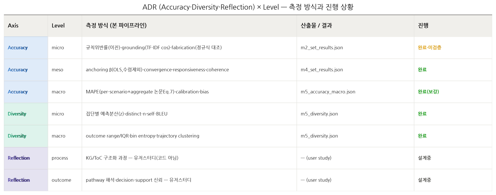
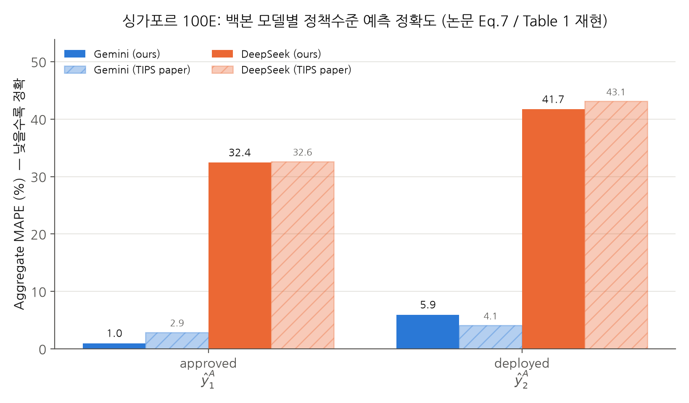
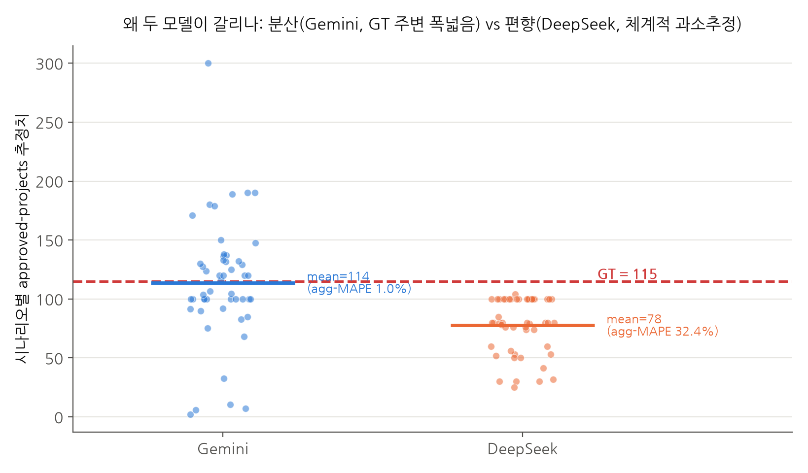
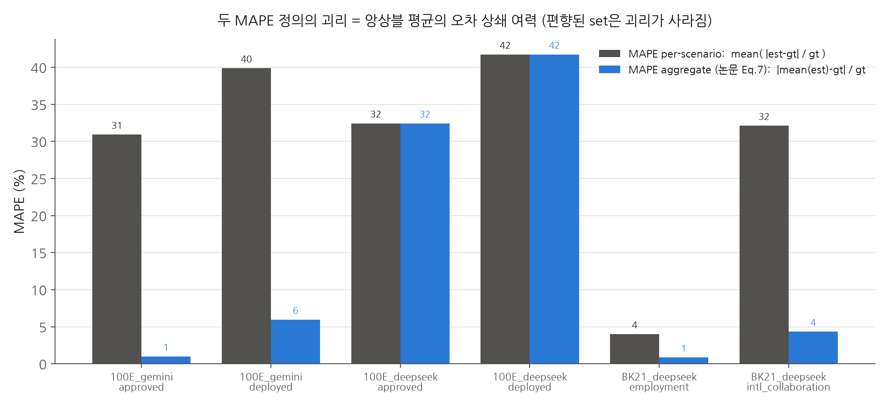

# TIPS 발화 평가 파이프라인 — 랩미팅 정리 (2026-07-15)

> 논문 *"Accuracy, Diversity, and Reflection: Purpose-driven Evaluation for Social Simulation"* 의
> **axis × level** 프레임(발표자료 p.15–16)을 우리 정책 시뮬레이션(TIPS)에 이식한 결과다.
> 세 개의 독립 50-set: **100E-deepseek, 100E-gemini, BK21-deepseek** (각 시나리오 50 × 발화 2,500 = 총 7,500 발화 × 파생).
> 전 지표 **API-free**(rule/lexical/numeric), GT는 TIGRIS Appendix E Table 4 값만 사용.

---

## 0. 한눈에 보기 — 마일스톤 진행 상황

| 마일스톤 | 내용 | 상태 | 산출물 |
|---|---|:--:|---|
| **M0** 데이터 인벤토리 | 폴더 스캔, 100E 변수키 확정, gt_map 고정 | ✅ 완료 | `config/policies.yaml` |
| **M1** IR 파서 | 3-set → IR 150 시나리오, Gemini 5폴더 재색인·중복0 | ✅ 완료 | `data/ir/*.jsonl` |
| **M2** Accuracy/micro | 규칙위반·grounding·fabrication | ✅ 산출완료 · ⚠️미검증 | `results/m2_*.{json,csv}` |
| **M3** 신뢰성(α) | gold pool 샘플링 + Krippendorff α | 🟡 진행중 | `data/gold/*` |
| **M4** Accuracy/meso | anchoring β·convergence·responsiveness·coherence | ✅ 완료 | `results/m4_*.{json,csv}` |
| **M5** Diversity + macro-Accuracy | 분산·distinct-n·self-BLEU·range·clustering + **MAPE/calibration** | ✅ 완료(**macro 보강**) | `results/m5_*.json` |
| **M6** 리포트 | axis×level 표 + 시각화 | 🟡 진행중(본 문서·figures가 초안) | `results/figures/`, 본 문서 |

**오늘의 핵심 업데이트**: M5 macro-accuracy에 **논문 정의(Eq.7)의 aggregate MAPE**를 추가해
**싱가포르 100E의 백본 모델 성능차이(DeepSeek≪Gemini)를 재현**했다. (§4)

---

## 1. Axis × Level 프레임과 우리 측정 방식 매핑

| Axis | Level | 논문의 "측정 가능 지표" | 우리 구현(측정 방식) | 상태 |
|---|---|---|---|:--:|
| Accuracy | micro | 규칙 위반률(이진분류) | KG 규범 lexicon 매칭 위반률 + grounding(TF-IDF cos) + fabrication(정규식 수치 대조) | ✅⚠️ |
| Accuracy | **macro** | **기존 MAPE** | **MAPE(per-scenario + aggregate 논문Eq.7) + calibration + bias** | ✅ |
| Diversity | micro | 이해관계자 집단별 예측값 분산, 발화 정성 확인 | 집단별 z-정규화 분산 + distinct-n + self-BLEU | ✅ |
| Diversity | macro | 타겟 field outcome range | range/IQR + bin entropy + trajectory clustering | ✅ |
| Reflection | process/outcome | 연구자 관점·유저스터디 | (코드 아님) 유저스터디로 진행 | 🟡 설계중 |

> 논문도 "모든 지표를 충족할 필요는 없고 목적에 맞게 선정"이라고 명시. 우리는 **Accuracy(micro/macro),
> Diversity(micro/macro)** 를 코드로 산출하고, **Accuracy/meso**(상호작용)는 유지, **Reflection**은
> 유저스터디로 분리했다.

---

## 2. Task별 측정 방식 · 현재 결과 · 다음 방향

### 2.1 Accuracy / micro (M2) — 개별 발화가 정책 문서 제약을 지키는가
**측정 방식**
- **규칙 위반률(violation_rate)**: KG의 `(role, must/can/cannot, action)` 규범에서 역할별 lexicon 구축 → 형태소 정규화 발화와 매칭. 위반 발화 / 적용규범 있는 발화.
- **Grounding(grounded_ratio)**: 정책 원문·KG 라벨 TF-IDF 인덱싱 → 발화와 코사인 최댓값 ≥ 임계. (Outputs/Outcomes/Impact 미래예측 phase는 분모 제외 → M4 coherence로 위임)
- **Fabrication(fabrication_rate)**: 발화 수치·개체를 정규식 추출 → 원문 부재 시 날조. 원문에서 산술 도출 가능한 값은 `derived_estimate`로 분리(합산 안 함).

**현재 결과**

| set | violation_rate | grounded_ratio | fabrication_rate | derived_estimate |
|---|---:|---:|---:|---:|
| BK21_deepseek | 0.0008 (2/2500) | 0.50 | 0.644 | 0.232 |
| 100E_deepseek | 0.0 (0/1560) | 0.574 | 0.748 | 0.006 |
| 100E_gemini | 0.0 (0/1710) | 0.426 | 0.899 | 0.004 |

- 100E는 PolicyRole 173명(deepseek 940 발화·gemini 790 발화)이 KG상 institutional position 없음 → 위반률 분모에서 제외(별도 카운트).
- **관찰**: fabrication_rate가 높다(gemini 100E 0.90). 이는 "미래 phase에서 원문에 없는 구체 수치를 자유롭게 생성"하기 때문 — diversity의 원천이자 accuracy의 리스크. Gemini가 fabrication↑이면서 뒤(§4)에서 보듯 macro 정확도도 좋음 → "풍부하게 생성하되 평균은 맞다"는 패턴.

**다음 방향**: M3 α 검증 전까지 **전부 "unvalidated"**. grounding/fabrication gold 라벨링이 우선.

---

### 2.2 신뢰성 검증 (M3) — rule 판정을 믿을 수 있는가
**측정 방식**: gold pool 층화 샘플링(정책·역할·phase 고르게) → human 라벨 vs machine 라벨 Krippendorff α. **α ≥ 0.667 통과 지표만 본문 확정.**

**현재 상태**
- gold pool 샘플링·QA export **완료**: `violation_gold_pool`(452), `random_gold_pool`(120), `boundary_gold_pool`(399), grounding/fabrication split, 역할배정 QA(qa1/2/3).
- **violation 축**: human 라벨 452개 채워짐. 그러나 **gold 양성 0건 / machine 양성 2건(모두 FP)** → base rate ≈ 0 이라 **α = −0.001 (degenerate, 검증 불가)**. "위반 규칙이 거의 안 걸린다"는 것 자체는 확인, 그러나 재현성은 양성 표본 부족으로 판정 불가.
- **grounding·fabrication 축**: gold 라벨 **미기입(0/40, 0/120)** → α 미산출.

**다음 방향**(가장 급함)
1. **fabrication·grounding gold 라벨링**(각 축 ~40–120건) → α 산출. 이게 M2 전체를 "확정"으로 올리는 게이트.
2. violation은 양성 표본 부족 → boundary pool 위주로 hard-negative/positive를 더 확보하거나, 위반 규칙 recall을 재점검.

---

### 2.3 Accuracy / meso (M4) — 발화 간 상호작용
**측정 방식**(순수 numeric): **anchoring β**(Δ_revised를 peer_signal에 OLS, 수렴 시리즈 제외) · **convergence_rate**(revised 전부 동일 비율) · **responsiveness**(moved_ratio) · **cross-phase coherence**(연속 phase TF-IDF 코사인).

**현재 결과**

| set | convergence_rate | anchoring β(mean/med) | responsiveness(moved) | coherence(cos) |
|---|---:|---:|---:|---:|
| BK21_deepseek | 0.701 | 0.0 / 0.0 (n=269) | **0.0** | 0.197 |
| 100E_deepseek | 0.641 | 0.0 / 0.0 (n=377) | **0.0** | 0.228 |
| 100E_gemini | 0.629 | 0.0 / 0.0 (n=390) | **0.0** | 0.247 |

- **⚠️ 중요 관찰**: `moved_ratio = 0` (revised 예측값이 initial과 수치가 동일). 즉 2라운드 "수정"이 **예측 숫자를 바꾸지 않았다** → anchoring β가 전부 0으로 나오는 이유. 수렴률도 63–70%로 높음(herding). **이건 데이터/시뮬레이터 설계 이슈일 수 있어 미팅에서 확인 필요**: revised_posts가 narrative만 갱신하고 prediction_values는 그대로인가?

**다음 방향**: revised의 prediction_values가 initial과 같은 원인 규명(시뮬레이터 사양 vs 파싱). 텍스트 기반 responsiveness(또래 term-overlap)를 보조 지표로 추가 검토.

---

### 2.4 Accuracy / macro (M5-a) — ToC chain 최종 예측이 실제 성과에 근접하는가 ★오늘의 보강
→ **§4에서 상세** (싱가포르 백본 모델 성능차이 포함).

---

### 2.5 Diversity (M5-b)
**측정 방식** — micro: 집단별 z-정규화 예측 분산 + distinct-n + self-BLEU(↑일수록 다양성↓). macro: outcome range/IQR + bin entropy + 5-phase trajectory clustering.

**현재 결과(발췌)**

| set | between-role 분산 | distinct-2 | self-BLEU | trajectory clusters |
|---|---:|---:|---:|---|
| BK21_deepseek | 0.619 | 0.084 | 0.858 | k=2 (22/28) |
| 100E_deepseek | 0.646 | 0.112 | 0.814 | k=4 (3/19/15/13) |
| 100E_gemini | 0.699 | **0.159** | **0.650** | k=2 (4/46) |

- **관찰**: **Gemini가 어휘적으로 가장 다양**(self-BLEU 0.65 ≪ deepseek 0.81–0.86, distinct-2 최고). 그리고 §4에서 보듯 macro 정확도도 최고 → **"다양성이 진실 주변에서 발생"**. 100E_deepseek은 pathway 유형이 4개로 갈리지만(clustering), 예측은 편향(§4).

**다음 방향**: Plausible-Diversity 필터(fabrication/grounding 통과 발화에만 diversity 집계)가 아직 passthrough — M3 검증 후 필터 적용.

---

### 2.6 Reflection (M5 범위 밖)
process/outcome 모두 유저스터디. 코드 지표 아님. (선택) pathway_completeness를 sanity-check 프록시로만 사용.
**다음 방향**: 웹 인터페이스 + RQ 기반 질문 구성(발표자료 진행상황과 연결).

---

## 3. PPT용 통합 결과표 (복붙용)

### 표 A. Macro-Accuracy 전체 (세 set) — 논문식 aggregate MAPE 기준

| set | target | GT | **MAPE(agg, 논문식)** | MAPE(per-scenario) | mean_est | bias% | coverage[p10,p90] |
|---|---|---:|---:|---:|---:|---:|:--:|
| 100E_gemini | approved | 115 | **0.98** | 30.91 | 113.9 | −1.0 | ✅ |
| 100E_gemini | deployed | 73 | **5.95** | 39.87 | 77.3 | +5.9 | ✅ |
| 100E_deepseek | approved | 115 | **32.44** | 32.44 | 77.7 | −32.4 | ❌ |
| 100E_deepseek | deployed | 73 | **41.72** | 41.72 | 42.6 | −41.7 | ❌ |
| BK21_deepseek | employment_rate | 82.2 | **0.85** | 4.00 | 82.9 | +0.9 | ✅ |
| BK21_deepseek | intl_collab_rate | 36.0 | **4.33** | 32.11 | 34.4 | −4.3 | ✅ |

### 표 B. M2 micro / 표 C. M4 meso — §2.1, §2.3의 표를 그대로 사용.

---

## 4. ★ 싱가포르(100E) 백본 모델 성능차이 — TIPS 논문 재현

발표자료가 참조하는 **TIPS 논문 Table 1**은 100E(=Policy A)에서 **Gemini-2.5-Flash가 DeepSeek-V4-Flash를 크게 앞선다**고 보고한다.
논문의 MAPE는 **Eq.(7)의 정책수준 점추정** `ŷ_p = (1/S)Σ ŷ(s)` 를 먼저 만든 뒤 GT와 비교한다(**aggregate-first**).
기존 파이프라인은 **per-scenario 평균 MAPE**만 계산해 이 모델차이가 드러나지 않았다 → **오늘 aggregate MAPE를 추가**했다.

| 100E target | GT | Gemini (ours / 논문) | DeepSeek (ours / 논문) |
|---|---:|---:|---:|
| approved (ŷ1_A) | 115 | **0.98 / 2.87** | **32.44 / 32.61** |
| deployed (ŷ2_A) | 73 | **5.95 / 4.08** | **41.72 / 43.09** |

- **DeepSeek 값은 논문과 거의 정확히 일치**(32.44 vs 32.61, 41.72 vs 43.09), Gemini도 같은 우수 regime(≈1–6%). → **우리 IR·집계가 논문 파이프라인과 정합**함을 검증.
- 논문 6-타겟 평균: Gemini **13.62** / DeepSeek **25.72**.

### 왜 갈리나 — 분산 vs 편향

- **Gemini**: 시나리오 추정이 GT 주변에 **폭넓게 분산**(sharpness 114, coverage ✅), 편향 ≈ 0(−1.0%) → **앙상블 평균이 GT에 수렴** → aggregate MAPE 1.0%인데 per-scenario는 30.9%.
- **DeepSeek**: **체계적 과소추정**(mean 77.7 vs GT 115, bias −32%, coverage ❌) → 평균 자체가 벗어나 aggregate ≈ per-scenario(둘 다 큼). 앙상블 평균으로 편향이 상쇄되지 않음.

> **결론**: (1) 정책수준 예측 정확도는 반드시 **aggregate MAPE**(논문 지표)로 봐야 하고, (2) **calibration(coverage/sharpness) + bias**를 함께 봐야 "분산이 커서 per-scenario가 나쁜 것"과 "편향돼 근본적으로 부정확한 것"을 구분할 수 있다. (3) 싱가포르 100E에서 **Gemini ≫ DeepSeek** — 논문과 동일 방향·유사 크기로 재현됨.

---

## 5. 미팅 논의 포인트 / 다음 스텝

1. **M4 `moved_ratio = 0` 확인** — revised가 prediction_values를 정말 안 바꾸는지(시뮬레이터 사양 vs 파싱). anchoring 분석의 전제.
2. **M3 gold 라벨링** — fabrication/grounding α 산출이 M2 전체를 "확정"으로 올리는 게이트. violation은 양성 표본 부족 문제.
3. **macro 정확도 보고 기준 합의** — 논문 재현/비교는 aggregate MAPE, 그러나 per-scenario·bias·calibration 병기(§6 이상치 정책).
4. **새 정책(미국 Child Tax Credit·NY Clean Heat) 적용** — 동일 파이프라인으로 MAPE/ADR 산출.
5. Plausible-Diversity 필터 적용(M3 통과 후), Reflection 유저스터디 설계.
